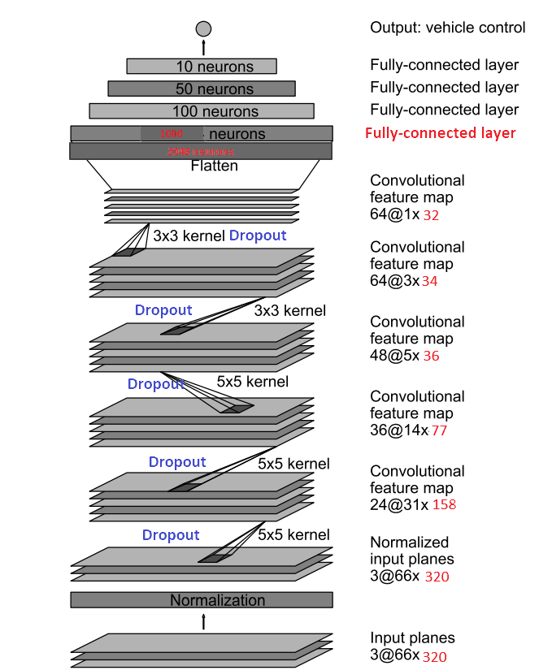
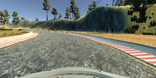
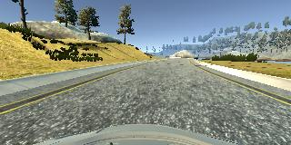
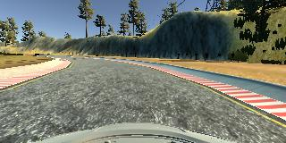
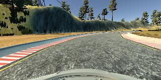

# **Behavioral Cloning** 

---

**Behavioral Cloning Project**

The goals / steps of this project are the following:
- [x] Use the simulator to collect data of good driving behavior
- [x] Build, a convolution neural network in Keras that predicts steering angles from images
- [x] Train and validate the model with a training and validation set
- [x] Test that the model successfully drives around track one without leaving the road
- [x] Summarize the results with a written report


---
### Files Submitted & Code Quality

#### 1. Submission includes all required files and can be used to run the simulator in autonomous mode

My project includes the following files:
* model.py containing the script to create and train the model
* drive.py for driving the car in autonomous mode
* model.h5 containing a trained convolution neural network 
* writeup_report.md or writeup_report.pdf summarizing the results

#### 2. Submission includes functional code
Using the Udacity provided simulator and my drive.py file, the car can be driven autonomously around the track by executing 
```sh
python drive.py model.h5
```

#### 3. Submission code is usable and readable

The model.py file contains the code for training and saving the convolution neural network. The file shows the pipeline I used for training and validating the model, and it contains comments to explain how the code works.

### Model Architecture and Training Strategy

#### 1. An appropriate model architecture has been employed

My model consists of a convolution neural network with three 5x5 filter size  depths are 24, 36 and 48 respectively. In the  5x5 filters there are 2x2 size stride  to reduce the size of the activation map.  Then followed  two 3x3 filter sizes and depths are both 64. After convolution layers, there are four fully connected layers in the end of network.  (model.py lines 18-42) 

The model includes RELU layers to introduce nonlinearity (followed each convolution layer), and the data is normalized in the model using a Keras lambda layer (code line 19). The input images cropped bottom and upper portion, to remove the sky and the hood of the car which are not useful in the training. 


#### 2. Attempts to reduce overfitting in the model

The model contains dropout layers in order to reduce overfitting( After each convolution layers). And the drop rate is set to 0.2. 

The model was trained and validated on different data sets to ensure that the model was not overfitting (code line 12). The model was tested by running it through the simulator and ensuring that the vehicle could stay on the track.

#### 3. Model parameter tuning

The model used an adam optimizer, so the learning rate was not tuned manually (model.py line 43).

#### 4. Appropriate training data

Training data was chosen to keep the vehicle driving on the road. I used only center captured images, and  augmented images to increase dataset.

For details about how I created the training data, see the next section. 

### Model Architecture and Training Strategy

#### 1. Solution Design Approach

My first step was to use a convolution neural network model similar to the  [Nvidia's end to end network](), which is appropriate due to the application is almost the same as this project. We have the captured frames with steers angel, just like the data in Nvidia's model.

The method in Nvidia's thesis is to use a frame with the steer angel to train steer angle in that frame, which is quite simple, and intuition method to control steer and learn driver's behavior. 

In order to gauge how well the model was working, I split my image and steering angle data into a training and validation set. I found that my first model had a low mean squared error on the training set but a high mean squared error on the validation set. This implied that the model was overfitting. 

To combat the overfitting, I modified the model with dropout layer after each convolution layer. Then I get lower loss with dropping layers.

The final step was to run the simulator to see how well the car was driving around track one. There were a few spots where the vehicle departure one side, which because the road track is counter clockwise. To improve the driving behavior in these cases, I make a little augmentation to flip captured images and negative the steer angel. You can find these augmentation function in input.py(line 40 to 89). I also made a little effort to preprocess input data more efficiently which also in input.py files.

At the end of the process, the vehicle is able to drive autonomously around the track without leaving the road.

#### 2. Final Model Architecture

The final model is just the like the model in [Nvidia's end to end network](https://arxiv.org/abs/1604.07316).  The input is refined to 66x320x3 ( After cropping the upper and bottom portion of the image). I modified Nvidia's model slightly to fit our inuput images size.  In the following figure, is the model in this project. The colored fonts means modified from Nvidia's end to end model. The input images in this model is 66x320(in Nvidia's model is 66x200), which is bigger than Nvidia's end to end model. So I added one fully connected layer with 1000 neurons after the last 3x3 filter size convolution layer to make the balance the the neuron size between convolutional and fully connected layer. 



#### 3. Creation of the Training Set & Training Process

**Data Collection**

To capture good driving behavior, I first recorded two laps on track one using center lane driving and in forward direction .  And to balance the counter clockwise track. I made turn driving to opposite direction.

Here is an example images of two dataset:

​			



​									driving forward direction



​									driving opposite direction

There is three dataset in three directories in 'data' directory, which are:

- train0 - dataset download from udacity example
- train1 - driving forward
- train2 - driving oppposite direction

There are IMG/ and driving_log.csv in each dataset directory.

**Data augmentation**

Here, I applied flipping to increase dataset. Flipping images is the best method in driving training, which can much balance the steer angel and road direction. I flipped three dataset, and negative steer angle .


Now I had six dataset in 'data':

- train0
- train0_flip
- train1
- train1_flip
- train2
- train2_flip

You can import input.py, then execute these function to augment all dataset in the 'data' directory.

	input.modify_all_logfile('data')
	input.augment_all_train_data('data')


- examples of flipped and origin images.







After the collection process, I had 34474 number of data points. I then preprocessed this data by  keras lamdba, normalize images to -0.5 to 0.5, And cropped the upper sky portion and bottom hood of the car portion.(in model.py 19-21 line) 


I finally randomly shuffled the data set and put 20% of the data into a validation set. 

I used this training data for training the model. The validation set helped determine if the model was over or under fitting. I trained model in 40 epochs, used ModelCheckpoint function in keras to save checkpoint model in every epoch and store loss MSE as checkpoint name and only  saved  improved model. So that, after the 40 epochs, I can choose the best model checkpoint as I need.

I used adam method to automatically adjust learning rate. 

This is quite funny project, I used keras to create network very quickly.  And I  also used generator to dynamically load batch data into memory to overcome the memory limitation which I had memory issue before, which quite helpful! I would like to try augmentation by GPU which can ease the memory loading a lot!!!

